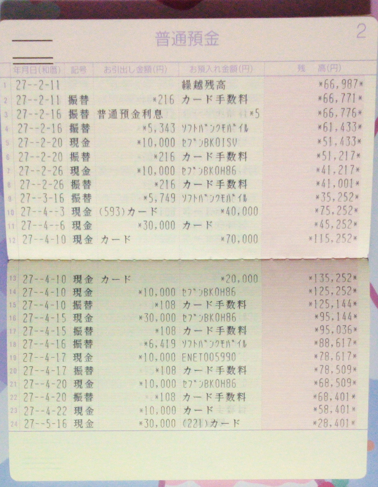
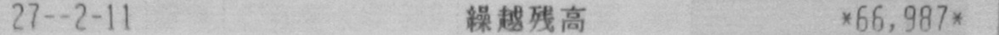
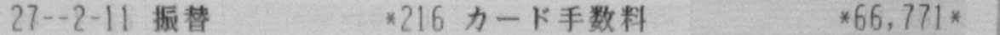
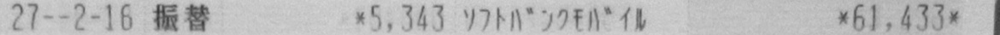
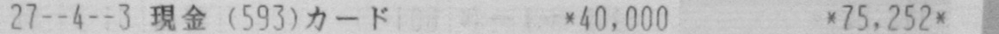
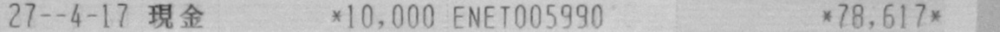

# teach_all

> 从「会调 `nn.Linear`」到「敢在板子上跑 NCNN」——一条尽量不跳步的视觉算法学习航线。

本仓库是作者在 PyTorch 视觉方向的**教学向代码合集**：图像分类 → 目标检测 → 语义分割 → 部署量化，按目录拆开，方便你对照视频/文档一点点啃。  
代码追求 **能跑通、能读懂、能改**；不是论文刷榜仓库，但也不想做「只有截图没有脚本」的 PPT 工程。

**微信**：`zuiaixiaopaomo`（有问题欢迎来聊；报错日志比「老师救命」更有用 😉）

---

## 你能在这里学到什么

| 阶段 | 你会练到的肌肉 |
|------|----------------|
| 分类 | Backbone 怎么长、数据怎么喂、混淆矩阵怎么读 |
| 检测 | 从 YOLO 的「一把梭」到 Faster R-CNN 的「两阶段优雅」，再到 BEVFusion 的多传感器 3D |
| 分割 | 像素级标签、实时分割训练与推理链路 |
| 部署 | ONNX / NCNN / 量化——模型从实验室搬进手机/边缘端 |

建议学习顺序（可按胃口加菜）：

```text
data_split / docs/utils
    ↓
pytorch_classifier（ResNet → MobileNet → …）
    ↓
pytorch_object_detection（YOLOv1 → Faster R-CNN → BEVFusion）
    ↓
pytorch_segment
    ↓
quantization + NCNN
```

---

## 仓库地图

| 目录 | 干什么的 | 成熟度 |
|------|----------|--------|
| [`pytorch_classifier/`](./pytorch_classifier) | 图像分类：ResNet / SE-ResNet / MobileNet / ShuffleNet / EfficientNet 等 | 持续扩充 |
| [`pytorch_object_detection/`](./pytorch_object_detection) | 目标检测：YOLOv1、Faster R-CNN、BEVFusion（3D） | 主力更新区 |
| [`pytorch_segment/`](./pytorch_segment) | 语义分割：Realtime Segment 等 | 建设中 |
| [`NCNN/`](./NCNN) | Windows 下 NCNN 工具链 + 分类推理 demo + B 站课 | 可用 |
| [`quantization/`](./quantization) | 量化相关资料与资源链接 | 建设中 |
| [`data_split/`](./data_split) | 数据集划分 & Dataset 加载小工具 | 可用 |
| [`docs/`](./docs) | 基础操作、Grad-CAM、数据增强、BankTest OCR 案例等「瑞士军刀」 | 可用 |
| [`vision/`](./vision) | torchvision 风格模型/数据参考实现 | 建设中 |

每个子目录都有自己的 README——点进去就是该专题的说明书。  
空着的章节不是偷懒，是**预留工位**：欢迎你后续一起填坑。

---

## 快速开始（通用）

多数 2D 分类/检测示例可参考根目录依赖（按子项目为准）：

```bash
conda create -n teach_all python=3.8 -y
conda activate teach_all
pip install -r requirement.txt
```

> ⚠️ **重要**：BEVFusion、部分检测项目有**独立环境与安装脚本**，不要强行塞进同一个 conda。  
> 例如：[`pytorch_object_detection/bevfusion_mit_han_lab`](./pytorch_object_detection/bevfusion_mit_han_lab) 请按该目录 README 的 `install_env.sh` 走。

---

## 数据集网盘（常用）

链接可能过期；失效了就喊一声，能补就补。

| 数据 | 链接 | 提取码 |
|------|------|--------|
| 动物分类（部分链接可能失效） | [百度网盘](https://pan.baidu.com/s/1b0lbd8vOfZcq0V5NyGbroQ) | `qdbo` |
| VOC2007 | [百度网盘](https://pan.baidu.com/s/16OqxENtluH96rek-w1jkEA?pwd=ceaa) | `ceaa` |
| Cityscapes | [百度网盘](https://pan.baidu.com/s/1So9aG9_7J0_ofgLf2vdSJg?pwd=2v4f) | `2v4f` |
| CDLA | [百度网盘](https://pan.baidu.com/s/1oep1ZUm1a7ey5txA_WhEYA?pwd=a98k) | `a98k` |

更多专题数据见各子目录 README。

---

## 近期亮点

- **BEVFusion（MIT Han Lab）教学复现**：nuScenes mini 上 Camera+LiDAR 融合检测，含安装脚本、训练与可视化说明  
  → [`pytorch_object_detection/bevfusion_mit_han_lab`](./pytorch_object_detection/bevfusion_mit_han_lab)
- **Faster R-CNN 教学版**：联合训练默认开箱，附结构/损失/面试速记文档  
  → [`pytorch_object_detection/faster_rcnn`](./pytorch_object_detection/faster_rcnn)
- **分类 + 混淆矩阵**：指标不只写在 PPT 上，代码里也能画出来  
  → [`pytorch_classifier/Confusion_Matrix`](./pytorch_classifier/Confusion_Matrix)
- **BankTest 银行存折 OCR 案例**：原图 → 行切分 → 结构化流水，适合做 OCR 流水线演示  
  → [`docs/BankTest`](./docs/BankTest)

---

## BankTest · 银行存折 OCR 案例展示

针对日本银行存折（通帳）的端到端识别样例：从整页拍摄图 → 行切分 → 字段结构化解析。

```text
原图拍摄 / 矫正
      ↓
按行裁切（ocr_line）
      ↓
OCR 识别 + 字段映射（getStringMap）
      ↓
结构化交易流水
```

素材目录：[`docs/BankTest`](./docs/BankTest)

### 1. 原图输入

<p align="center">
  
</p>

<p align="center"><sub>普通預金 · 第 2 页 · 共 24 条交易记录</sub></p>

### 2. 行切分样例

将整页通账按行裁切，便于逐行 OCR。以下为代表性样例：

| 行 | 裁切图 | 说明 |
| :---: | --- | --- |
| line0 |  | 繰越残高（结转余额） |
| line1 |  | 振替 · カード手数料 |
| line3 |  | ソフトバンクモバイル 扣款 |
| line9 |  | 現金 · カード 存入 |
| line18 |  | ATM 取现 ENET005990 |

完整 24 行裁切图见：[`docs/BankTest/ocr_line`](./docs/BankTest/ocr_line)

### 3. 结构化识别结果

原始映射文件：[`getStringMap.txt`](./docs/BankTest/getStringMap.txt)

解析后的交易流水（平成 27 年 / 2015）：

| # | 年月日 | 記号 | お引出し | 摘要 / お預入れ | 残高 |
| :---: | :---: | :---: | ---: | --- | ---: |
| 1 | 27-2-11 | — | — | 繰越残高 | 66,987 |
| 2 | 27-2-11 | 振替 | 216 | カード手数料 | 66,771 |
| 3 | 27-2-16 | 振替 | — | 普通預金利息 · 5 | 66,776 |
| 4 | 27-2-16 | 振替 | 5,343 | ソフトバンクモバイル | 61,433 |
| 5 | 27-2-20 | 現金 | 10,000 | セブンBK01SU | 51,433 |
| 6 | 27-2-20 | 振替 | 216 | カード手数料 | 51,217 |
| 7 | 27-2-26 | 現金 | 10,000 | セブンBK0H86 | 41,217 |
| 8 | 27-2-26 | 振替 | 216 | カード手数料 | 41,001 |
| 9 | 27-3-16 | 振替 | 5,749 | ソフトバンクモバイル | 35,252 |
| 10 | 27-4-3 | 現金 | — | (593)カード · 40,000 | 75,252 |
| 11 | 27-4-6 | 現金 | 30,000 | カード | 45,252 |
| 12 | 27-4-10 | 現金 | — | カード · 70,000 | 115,252 |
| 13 | 27-4-10 | 現金 | — | カード · 20,000 | 135,252 |
| 14 | 27-4-10 | 現金 | 10,000 | セブンBK0H86 | 125,252 |
| 15 | 27-4-10 | 振替 | 108 | カード手数料 | 125,144 |
| 16 | 27-4-15 | 現金 | 30,000 | セブンBK0H86 | 95,144 |
| 17 | 27-4-15 | 振替 | 108 | カード手数料 | 95,036 |
| 18 | 27-4-16 | 振替 | 6,419 | ソフトバンクモバイル | 88,617 |
| 19 | 27-4-17 | 現金 | 10,000 | ENET005990 | 78,617 |
| 20 | 27-4-17 | 振替 | 108 | カード手数料 | 78,509 |
| 21 | 27-4-20 | 現金 | 10,000 | セブンBK0H86 | 68,509 |
| 22 | 27-4-20 | 振替 | 108 | カード手数料 | 68,401 |
| 23 | 27-4-22 | 現金 | 10,000 | カード | 58,401 |
| 24 | 27-5-16 | 現金 | 30,000 | (221)カード | 28,401 |

### 4. 字段含义速查

| 字段 | 含义 |
| --- | --- |
| 年月日（和暦） | 交易日期，示例中 `27` 为平成 27 年 |
| 記号 | 交易类型，如 `振替`（转账）、`現金`（现金） |
| お引出し金額 | 支出金额（円） |
| お預入れ金額 / 摘要 | 存入金额或商户 / ATM 备注 |
| 残高 | 交易后余额（円） |

### 5. 原始映射格式示例

```text
type:{1} size:{5}
  amount:{}  keyword:{27-2-11}
  amount:{}  keyword:{振替}
  amount:{216}  keyword:{}
  amount:{}  keyword:{カード手数料}
  amount:{66,771}  keyword:{}
```

每一行对应 `ocr_line/lineN.jpg` 的识别结果，按「日期 / 記号 / 金额 / 摘要 / 余额」五段字段展开。

---

## 贡献与吐槽指南

1. Issue / PR 欢迎：修 typo、补注释、补「我踩过的坑」都算功德。  
2. 提 bug 时请附：**环境、命令、完整报错**（截图可以，文本更好）。  
3. 本仓库中文优先；英文注释不强制，可读就行。

---

## 免责声明（轻松版）

- 代码以教学为主，工业落地请自行加固（日志、配置、异常、CI……该有的还是要有）。  
- 第三方权重/数据集版权归原作者；网盘链接仅方便同学，不作永久托管承诺。  
- GPU 驱动、CUDA、PyTorch 版本合不合拍，是深度学习永恒的浪漫冲突——请先看各子项目环境说明。

---

## Star 一下？

如果你觉得这仓库帮你省下了半夜 debug 的时间，点个 ⭐ 就是最好的续杯。  
接下来会继续把分割、量化和更多检测家族补全——**路线图画好了，坑也留好了，慢慢填。**
